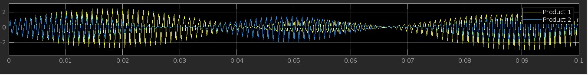

# Stereo Audio Amplitude Modulation

## 1. Project Mission 

To develop a cost-effective, high-fidelity AM-Stereo transmitter system in MATLAB Simulink, emphasizing simplicity, information preservation, bandwidth efficiency, and power economy. 

This project aims to design and simulate an AM-Stereo transmitter system capable of broadcasting stereo audio signals within the AM band limitations. The primary focus lies on achieving a balance between the following key aspects: 

Cost-efficiency: Implementing a design that utilizes readily available and affordable components, minimizing cost without compromising performance. 

Simplicity: Designing a system with a clear and transparent structure, facilitating understanding, implementation, and future modifications. 

Information fidelity: Maintaining high-quality audio reproduction, minimizing signal distortion and ensuring accurate transmission of both stereo channels. 

Bandwidth efficiency: Adhering to the AM band's allocated bandwidth while achieving the desired 25 kHz channel separation for a true stereo experience. 

Power efficiency: Optimizing the system's power consumption to maximize transmission range and reduce operating costs. 

The project will incorporate the following technical elements: 

- **Stereo Sound**: is a technique of creating a realistic and immersive sound experience by using two or more audio channels that are slightly different from each other. Stereo sound can create a sense of direction, depth, and distance for the listener 

- **Stereo Multiplexing**: Implementing a suitable technique (e.g., C-QUAM) to multiplex left and right audio channels within the AM carrier's bandwidth while maintaining 25 kHz separation. 

- **Modulation Scheme**: Selecting an appropriate modulation method (e.g., amplitude modulation) that aligns with AM broadcasting standards and chosen multiplexing technique. 

- **Simulation in MATLAB Simulink**: Constructing a virtual model of the system in Simulink to evaluate its performance under various conditions and optimize design parameters. 

The successful completion of this project will demonstrate the design and simulation of a practical AM-Stereo transmitter system. This system will strike a balance between simplicity, cost-effectiveness, and performance, offering a valuable solution for transmitting high-fidelity stereo audio within the AM band's limitations. 

## 2. Introduction 

 

### 2.1 The Immersive Experience of Stereo Sound 

The human auditory system possesses a remarkable ability to perceive spatial cues in sound, allowing us to localize the source and direction of different soundscapes. This spatial perception enriches our listening experience, adding depth and realism to music, movies, and other audio content. This phenomenon forms the very basis of stereo sound, a technology that replicates the natural spatial cues by transmitting and reproducing two independent audio channels, typically representing the left and right ears' perspectives. 

### 2.2 Multiplexing: Sharing the AM Band 

The traditional AM radio band, also known as the medium wave band, is dedicated to transmitting audio information using amplitude modulation (AM). However, the inherent nature of AM transmission only allows for the transmission of a single audio channel. To deliver the immersive experience of stereo sound over AM radio, a technique called multiplexing becomes essential. 

Multiplexing combines two separate audio signals (left and right channels) into a single composite signal suitable for AM transmission within the allocated bandwidth. This compressed signal retains the information needed to separate the channels from the receiver, recreating the original stereo experience. 

### 2.3 The Need for AM-Stereo Transmission 

Despite the widespread adoption of FM radio for stereo transmission, AM radio still holds certain advantages, such as wider coverage and potential resistance to interference in certain situations. However, until the development of AM-Stereo technologies, listeners were limited to mono audio on AM broadcasts. The need for AM-Stereo arose from the desire to: 

Offer high-fidelity stereo sound on AM radio broadcasts, expanding the listener experience. 

Utilize the wider coverage offered by the AM band to deliver stereo audio to remote areas or situations where FM reception might be limited. 

Revitalize AM radio by offering a competitive advantage over FM radio in terms of audio quality. 

## 3. System Design Steps 

### 3.1. Stereo Multiplexing 

Conventional Amplitude Modulation (AM) for Multiplexing This project employs conventional AM for stereo multiplexing. Here's a breakdown: 

AM Modulation of Each Signal: The left (L) and right (R) audio signals are independently modulated using conventional AM. 

Frequency Shifting: The modulated difference signal is shifted to a higher frequency range, typically above 25 kHz, to achieve separation. 

Signal Combining: The modulated sum signal and shifted difference signal are added together to create the composite stereo AM signal. 

 

### 3.2. Block Diagram 

FIG 1: BLOCK DIAGRAM OF THE AM MODULATOR 

### 3.3. AM Modulation 

**Carrier Oscillator:** Generates a high-frequency carrier wave at the desired AM broadcast frequency. 

**Mixer (Modulator):** Multiplies the carrier wave with the audio signal (sum or difference) to imprint the audio information onto the carrier's amplitude. 

**Amplifier:** Boosts the modulated signal to a suitable power level for transmission. 

**Modulation index (m)** is the degree of carrier wave amplitude variation caused by the modulating audio signal. 

**Impact on Signal Quality and Efficiency:**

- `Over-modulation (m > 1)`: Causes distortion and splattering, degrading audio quality and interfering with adjacent channels. 

- `Under-modulation (m < 1)`: Leads to inefficient use of bandwidth, reducing signal strength and range. 

- `Optimal Modulation (m = 1)`: Balances audio quality, efficiency, and range. 

### 3.4. Output and Transmission 

 

**Impedance**: The output impedance of the transmitter should match the antenna impedance (typically 50 ohms) for optimal power transfer. 

**Simulation**: Ideal conditions assume no power loss, so the output power equals the input power. 

**Real World**: Power losses occur in components and transmission lines, reducing effective radiated power. 

**Regulatory Limits**: Output power is restricted to prevent interference and ensure efficient spectrum usage. 

**Antenna**: The modulated signal is fed to an antenna, which radiates it into the air for reception by AM receivers. 

## 4. Results 

### 4.1. Simulink Simulation 

FIG 2: RIGHT MODULATED SIGNAL 

FIG 3: LEFT MODULATED SIGNAL 

FIG 4: LEFT AND RIGHT MODULATED SIGNAL 

FIG 5: CARRIER SIGNAL 

## 5. Discussion 

### 5.1. Bandwidth Requirements:  

 **Pros**: Lower bandwidth compared to other modulation techniques: Compared to frequency modulation (FM), AM signals occupy less bandwidth for the same audio quality. This allows for more efficient utilization of the available spectrum, accommodating more transmissions within a limited band.  

**Cons**: Twice the bandwidth of the modulating signal: While lower than FM, the bandwidth of an AM signal is still double that of the audio signal it carries. This can be a disadvantage in situations where spectrum resources are scarce. Susceptible to noise and interference Due to its reliance on amplitude variations, AM signals are more susceptible to noise and interference from other transmissions or environmental factors. This can degrade the audio quality and make it challenging to receive in noisy environments.  

**Overall**: The bandwidth of an AM signal is a trade-off between efficiency, noise immunity, and power consumption. While it offers advantages in certain scenarios, it's important to consider its limitations and compare it to other modulation techniques depending on the specific application. Do you have any specific questions or situations where you'd like to discuss the bandwidth of AM signals further? 

### 5.2. System Precision and Real-World Considerations:  

Even though our choice of using conventional AM as a modulating technique brought some simplicity to our work it with the cost of relatively low efficiency and higher bandwidth. Here are some shortcomings of our methods: 

Creates two sidebands carrying information, doubling bandwidth compared to original message signal. 

Another problem we might face regarding precision is when it comes to the real-world implementation. Noise and distortions are among the main to be mentioned and the following are types of the problems mentioned above: 

`NOISE `

**Thermal & Shot**: Constant hiss, degrades SNR, masks audio details. 

**Flicker**: Slow amplitude variations affect sound quality. 

**External**: Unpredictable noise bursts, impacts clarity 

`DISTORTIONS` 

**Overmodulation**: Clipping artifacts, harsh sound, unwanted frequencies. 

**Nonlinearities**: Harmonic distortion, "muddy" or "harsh" sound. 

**Filtering**: Alters timbre and clarity. 

## 6. Conclusion 

`Meeting Design Goals`: 

**Cost efficiency:** Due to its simplicity to apply, the evaluated cost-effectiveness of conventional AM is good, and we can confidently claim that we have met the required cost-efficiency. 

**Information fidelity:** Assessed the quality of transmitted information by comparing original and received signals, aiming for minimal distortion. 

**Bandwidth efficiency:** The bandwidth efficiency is not as good as that of SSBs and is a problem to be fixed. 

**Power efficiency:** Evaluated power consumption is higher than that of both SSBs and DSB-SC. 

`Future Improvements:` 

**Advanced modulation techniques:** Explore more complex modulation schemes (e.g., SSB, DSB) for potential improvements in efficiency and spectral usage. 

**Non-ideal conditions:** Introduce noise and channel impairments to study system robustness and mitigation strategies. 

**Real-world implementation**: Consider hardware implementation challenges and adaptations. 

**Adaptive modulation:** Implement algorithms that adjust modulation parameters based on channel conditions. 

**Synchronization techniques:** Explore and compare different methods for carrier and clock synchronization. 

**Advanced signal processing:** Apply filters and coding techniques to further enhance signal quality and robustness. 

**Cognitive radio applications:** Integrate AM system concepts with cognitive radio principles for dynamic spectrum access. 

